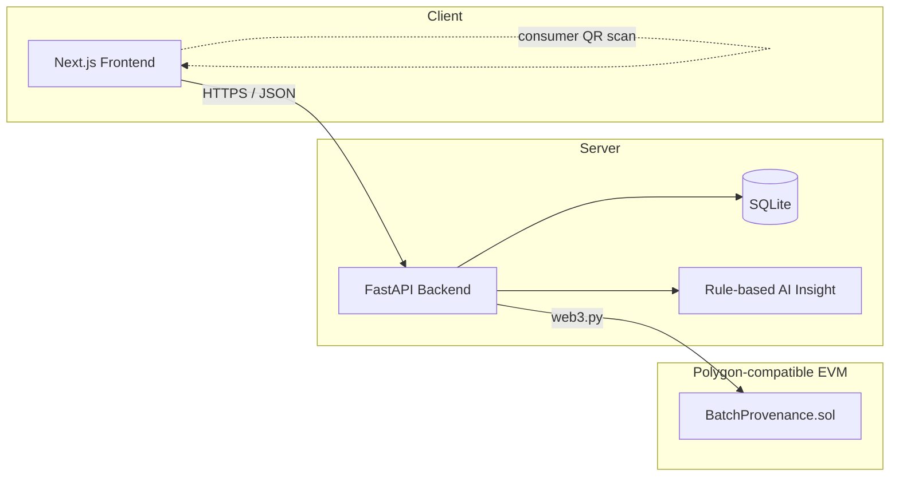

<div align="center">

# 🍯 Honey Chain

**Blockchain-based honey traceability and smart beekeeping platform**

Smart India Hackathon 2026 · Problem Statement 26021 · Ministry of MSME

[](https://nextjs.org/)
[](https://www.typescriptlang.org/)
[](https://fastapi.tiangolo.com/)
[](https://www.python.org/)
[](https://hardhat.org/)
[](https://polygon.technology/)
[](https://tailwindcss.com/)

[Setup](#quick-start) · [Features](#features) · [Architecture](#architecture) · [Tech Stack](#tech-stack) · [Roadmap](#roadmap)

</div>

---

## Overview

Honey Chain gives every jar of honey a tamper-evident, end-to-end paper trail — from hive to
consumer — so buyers can verify authenticity with a QR scan and KVIC can audit a cluster of
beekeepers without trusting a spreadsheet.

It's a full-stack system, not a mockup: a Next.js frontend and a FastAPI backend talk to each
other over HTTP with zero mock data, and every batch is anchored on-chain through a
batch-provenance smart contract — deployed and live by default against a local Hardhat chain
(zero wallet, zero signup), with an optional 15-minute path to a public Polygon Amoy deployment.

| | |
|---|---|
| **Frontend** | Next.js 14 (App Router) + TypeScript, server components fetching live from the API |
| **Backend** | FastAPI + SQLite, fully wired — no stubbed routes |
| **Blockchain** | Solidity contract on a Polygon-compatible EVM chain, tested with Hardhat |
| **AI insight** | Rule-based hive health engine, drop-in replaceable by a trained model later |

## Features

| Route | What it does |
|---|---|
| `/` | Role selection — Beekeeper / Consumer / KVIC admin |
| `/beekeeper` | Beekeeper dashboard — hive overview, alerts, live stats from the API |
| `/beekeeper/hive/[id]` | Live hive monitoring — sensor cards, trend chart, AI insight (4 sample hives, one showing the offline/stale-data state) |
| `/beekeeper/batch/new` | Guided batch-creation wizard — POSTs to the backend, which records the batch and returns a real blockchain receipt |
| `/beekeeper/batch/[id]` | Batch detail — on-chain provenance timeline + QR code |
| `/verify/[id]` | Consumer-facing QR scan result (mobile-first), including a live chain-confirmation check |
| `/admin` | KVIC cluster dashboard — beekeepers, hives, flagged records |

## Architecture



Human-readable batch data lives in the backend's database; only a hash of it is written on-chain,
so no single party — KVIC, a distributor, or the app itself — can quietly edit history after the
fact.

## Quick Start

Requires [Node.js](https://nodejs.org) 18+ and Python 3.11+.

Three terminals for the full live experience (local chain included), or two if you're fine with
the zero-setup blockchain stub — see the note at the end of this section.

**1 · Local blockchain** (Hardhat — no wallet, no signup, free)

```bash
cd contracts
npm install
npx hardhat node             # leave this running
```

In a second terminal, deploy once — redeploying after a restart reproduces the same address, so
`backend/.env` (already configured for this) doesn't need touching again:

```bash
cd contracts
npm run deploy:local
```

**2 · Backend** (FastAPI + SQLite), in a third terminal

```bash
cd backend
python -m venv venv
venv\Scripts\activate        # Windows — `source venv/bin/activate` on macOS/Linux
pip install -r requirements.txt
copy .env.example .env       # `cp` on macOS/Linux — defaults work as-is
python -m app.seed           # creates honeychain.db with sample data
uvicorn app.main:app --reload --port 8000
```

**3 · Frontend** (Next.js)

```bash
npm install
copy .env.local.example .env.local   # `cp` on macOS/Linux — defaults work as-is
npm run dev
```

Open **http://localhost:3000**. Backend API docs: **http://localhost:8000/docs**.

> **Skipping the chain?** Blank out `POLYGON_RPC_URL`, `POLYGON_PRIVATE_KEY`, and
> `POLYGON_CONTRACT_ADDRESS` in `backend/.env` and restart the backend — it falls back to a
> zero-setup stub automatically, and step 1 becomes unnecessary. Every route still works; batch
> creation just returns a fabricated tx hash instead of a real one.

Both `.env.example` files ship with a matching `dev-local-key` / `HONEYCHAIN_API_KEY` pair, so
write endpoints work out of the box locally — see [Auth](#auth) before deploying anywhere else.

### Tests

```bash
# Backend — 8 tests: batch creation, validation, verify, API-key gating
cd backend && python -m pytest

# Contracts — 5-test Hardhat suite, spins up its own chain independently
cd contracts && npm test
```

## Tech Stack

<table>
<tr><td><b>Frontend</b></td><td>Next.js 14 · React 18 · TypeScript 5.5 · Tailwind CSS · Recharts · qrcode.react</td></tr>
<tr><td><b>Backend</b></td><td>FastAPI · SQLAlchemy 2 · Pydantic 2 · SQLite · web3.py</td></tr>
<tr><td><b>Blockchain</b></td><td>Solidity · Hardhat · Polygon (local Hardhat chain by default, Amoy testnet optional)</td></tr>
<tr><td><b>Testing</b></td><td>pytest + httpx (backend) · Hardhat/Chai (contracts)</td></tr>
</table>

## Project Structure

```
app/                        Next.js App Router pages (server components fetch from the API)
  page.tsx                  Home / role select
  beekeeper/                 Beekeeper section (own layout.tsx with sidebar)
  verify/[id]/                Consumer scan result
  admin/                        KVIC dashboard
  api/batches/route.ts     Server-side proxy for the one client-side write (batch creation) —
                             keeps the API key out of the browser bundle, see Auth below
  error.tsx                 Friendly fallback if the API can't be reached
components/                Shared UI components
lib/api.ts                 Typed fetch client — the only place that knows the backend's URL
lib/types.ts               Shared TypeScript types, matching the backend's Pydantic schemas 1:1
tailwind.config.ts         Design tokens (colors, fonts) — the whole visual system lives here

backend/
  app/main.py               FastAPI app, CORS, router wiring
  app/models.py              SQLAlchemy tables
  app/schemas.py               Pydantic request/response shapes (camelCase, matches the frontend)
  app/routers/                   hives, batches, beekeepers, admin endpoints
  app/blockchain.py                The only file that knows about chains — see Blockchain below
  app/auth.py                       Shared-secret API-key gate for write/admin routes
  app/insight.py                      Rule-based hive health engine behind "AI insight"
  app/contracts/                        Compiled contract ABI, used by blockchain.py's web3.py calls
  app/seed.py                             Loads sample data
  tests/                                    pytest suite (TestClient + an isolated SQLite file)

contracts/                 Solidity contract + Hardhat project (separate from the backend's Python env)
  contracts/BatchProvenance.sol   The on-chain batch-provenance ledger
  test/                             5 passing Hardhat tests
  scripts/deploy.js                  Deploys to a local Hardhat chain or Polygon Amoy
```

## Design System

Colors, fonts, and spacing are defined as tokens in `tailwind.config.ts` — change a value there
and it updates everywhere.

| Token | Hex | Use |
|---|---|---|
| `primary` | `#8C5A1E` | Honey brown, main actions |
| `gold` | `#F2A93B` | Highlights, KVIC/blockchain accents |
| `trust` | `#0F6E56` | Verified states, healthy status |
| `alert` | `#A94438` | Warnings, critical status |
| `ink` | `#231A10` | Dark surfaces (sidebar, hero sections) |

Typography: **Fraunces** (serif, headings) + **Manrope** (sans, body), loaded via
`next/font/google` — no extra setup needed.

## Blockchain

The provenance record for each honey batch lives partly on-chain — a tamper-evident hash trail —
so no single party can quietly edit batch history after the fact.

`contracts/contracts/BatchProvenance.sol` is written, its 5-test Hardhat suite passes, and it's
**deployed and live**. `backend/app/blockchain.py` is fully wired to it via `web3.py` — real
signed transactions on batch creation, real on-chain reads to verify a batch hasn't been
tampered with.

By default it points at a **local Hardhat chain** rather than the public Amoy testnet, to skip
wallet/faucet/RPC signup entirely — same EVM, same contract, same `web3.py` code path, just
running locally. See [contracts/README.md](contracts/README.md) for the ~15-minute, free, optional
path to a persistent **Polygon Amoy** deployment with a public, clickable Polygonscan link.

Blank the three connection env vars and the app falls back to a built-in stub (fabricated tx
hash/block number, zero chain involved) automatically — nothing else about the app changes.

## Auth

No login yet — no phone+OTP, no sessions, no per-user identity. What exists today is a
shared-secret gate (`backend/app/auth.py`): an `X-API-Key` header is required on `POST /batches`,
`POST /batches/{id}/events`, and all `/admin/*` routes, checked against `API_KEY` in
`backend/.env`. That closes the "anyone on the internet can write a batch or read the KVIC
dashboard" gap — but it's one key for everyone, not real auth.

The frontend's server components attach the key automatically from the server-only
`HONEYCHAIN_API_KEY` env var; the one client-side write (the batch-creation wizard) goes through
`app/api/batches/route.ts` instead, so the key never ships to the browser. Every page currently
acts as one seeded beekeeper (`lib/api.ts`'s `CURRENT_BEEKEEPER_ID`) — real phone+OTP login is the
next step (see [Roadmap](#roadmap)).

## AI Insight

The hive detail page's "AI insight" text comes from a rule-based engine
(`backend/app/insight.py`), not a trained model — there's no labeled failure dataset for these
hives to train one on yet. It reads each hive's live temperature, activity, weight trend, and
offline status, and picks a reason/action pair from a small set of thresholds (colony stress,
overheating, offline sensor, all-normal), computed fresh on every request.

It's real in that it reacts to actual sensor numbers — change a hive's readings, the insight
changes — but it's hand-written domain rules, not learned. A trained model is a drop-in
replacement later: nothing else in the app reads more than the `reason` / `action` strings it
returns.

## Roadmap

- [ ] Deploy the batch-provenance contract to the public **Polygon Amoy** testnet (currently live against a local chain only) for a persistent deployment with a real Polygonscan link
- [ ] Replace the shared API key with real authentication (phone + OTP) on the login/role-select flow
- [ ] Build the IoT ingestion path from real ESP32 hive sensors into the backend (hive data is seeded, not live, today)
- [ ] Train an actual model behind "AI insight" (disease detection, productivity prediction) once real sensor history exists — the rule-based engine is a reasonable stand-in until then

---

<div align="center">

Built for **Smart India Hackathon 2026** · PS 26021 · Ministry of MSME

</div>
